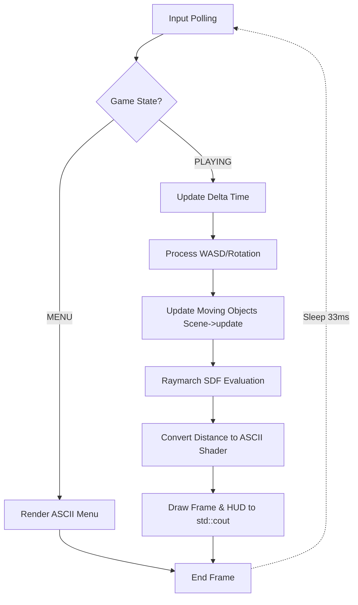
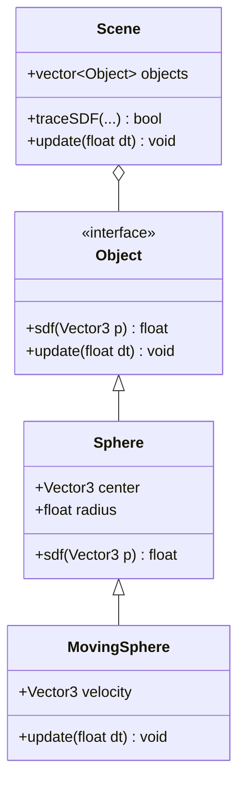

# Project Progress Report
## Terminal ASCII Raycasting Engine

**GitHub Repository Link:** [INSERT GITHUB LINK HERE]

---

## 1 Project Overview
**Project Goal:** 
The primary objective of this project is to develop a functional 3D rendering engine that outputs exclusively to standard text terminals. It utilizes raymarching algorithms alongside Signed Distance Functions (SDFs) to draw 3D primitives entirely out of ASCII characters.

**Problem it Aims to Solve:** 
Creating 3D visuals typically requires heavy external libraries (like OpenGL or DirectX). This project demonstrates how pure mathematical rendering can operate in highly constrained environments (like a barebones terminal), teaching core computer graphics concepts without relying on heavy frontend boilerplate frameworks.

**Intended Users/Context:** 
The application serves as a demonstration and educational framework for software developers, computer graphics students, and anyone interested in low-level mathematics, raycasting theory, and terminal-based tools.

**Current Development Stage:** 
The engine core is structurally complete. It features an interactive `GameState` loop, multiple scenes (static geometries, dynamic moving geometries, and a compiled mix), and a fully playable "Time Attack" game mode where the user shoots targets under a time limit. Basic input handling (WASD + camera rotation) is fully functional.

## 2 Design Illustrations

The system processes input, manages state transitions, updates geometric positions, and evaluates ray intersections using a mathematical raymarching pipeline.

### System Architecture Flowchart
*(This flowchart shows the general game loop and data propagation during a single frame).*


* **Explanation:** This diagram represents the core application loop. It demonstrates how user input drives either the UI logic (Menu) or the 3D Engine logic (Playing). The separation of state ensures the rendering pipeline only executes when necessary, optimizing CPU usage.

### Object Oriented Structure
*(This diagram shows how mathematical objects are structured for the SDF pipeline).*


* **Explanation:** This structural diagram highlights our polymorphism approach. By abstracting geometrical rendering to an `Object` interface implementing `sdf`, the `Scene` can raymarch any arbitrary geometry without knowing what the geometry is. The `MovingSphere` demonstrates dynamic inheritance.

## 3 Implementation and Sample Code

Our most significant progress lies within the Signed Distance Function raymarching loop and dynamic object updating logic.

### SDF Raymarching Implementation (`Scene::traceSDF`)
```cpp
bool traceSDF(const Vector3& ro, const Vector3& rd, float& outT, Vector3& outNormal, int& outMat, const Object** outHitObj = nullptr) const {
    const float MAX_DIST = 200.0f;
    const int MAX_STEPS = 240;
    const float EPS = 5e-4f;

    float t = 0.0f;
    for (int i = 0; i < MAX_STEPS && t < MAX_DIST; ++i) {
        Vector3 p = ro + rd * t;
        float closest = 1e6f;
        const Object* closestObj = nullptr;
        // Evaluate mathematical distance to the closest object in the scene
        for (const auto& o : objects) {
            float d = o->sdf(p);
            if (d < closest) { closest = d; closestObj = o.get(); }
        }
        if (closestObj == nullptr) break;
        // If distance is near zero, we have mathematically intersected the object
        if (closest < EPS) {
            // ... calculate normals via mathematical gradient ...
            return true;
        }
        t += closest; // March the ray forward by the safe un-colliding distance
    }
    return false;
}
```
* **Purpose:** This function drives the 3D rendering physics. It fires a ray from the camera and incrementally steps it forward.
* **System Fit:** It sits at the absolute core of the `Renderer`. For every single terminal character on screen, a ray is generated and sent through this loop to determine if geometry exists at that grid position.
* **Design Decision:** We chose Raymarching over conventional Rasterization because Raymarching handles abstract boolean structures and mathematical distances gracefully, allowing us to easily stack infinite planes or spherical objects without managing polygon triangle meshes.

### Dynamic Object Modification (`MovingSphere::update`)
```cpp
void update(float dt) override {
    totalTime += dt;
    // Oscillate back and forth mathematically using Sine
    float offset = sinf(totalTime * speed + timeOffset) * 5.0f;
    center = baseCenter + moveAxis * offset;
}
```
* **Purpose:** Allows mathematical primitives to physically traverse the 3D space during the Time Attack game mode.
* **System Fit:** Called by the master `Scene.update(dt)` loop directly before the rendering pass.
* **Design Decision:** Instead of tightly coupling rigid body physics, we used procedural animation via `sinf()` time offsets. This requires significantly fewer CPU calculations, a necessity given the intense performance cost already demanded by the main raymarching loop.

## 4 GitHub Repository Requirement

* **Repository Link:** [INSERT GITHUB LINK HERE]
* **Structure Overview:** 
  * `/include` - Contains math headers (`Vector3.h`) and geometrical primitive classes (`Box.h`, `Cylinder.h`, `MovingSphere.h`).
  * `/src` - Contains execution code (`main.cpp`, `Renderer.cpp`, `Input.cpp`).
  * `README.md` - Contains compilation details, setup instructions, and controls.
* **Commit Screenshot:**
  > [!TIP]
  > Please insert a screenshot of your GitHub commit history here to show your ongoing development process. 

## 5 Initial Results and Testing

> [!TIP]
> Please insert screenshots showing the Terminal menu and the actual game engine actively being played.

**Discussion:**
The results demonstrate successfully rendering 3D perspectives directly inside Windows terminal shells without generic graphic backends. The application runs smoothly on standard CPUs. The object-oriented approach handles multiple overlapping collision geometries consistently. Furthermore, the "Time Attack" mechanics correctly register raycasted hits against moving parameters reliably. 

**What needs improvement:** Due to the intrinsic limitations of writing strings to `std::cout`, some fast-moving frames still risk latency tearing if run on a slow or unoptimized terminal host software. 

## 6 Challenges and Solutions

**Challenge: Rendering Flickering / Frame Tearing**
* **The Problem:** Writing thousands of characters into the terminal iteratively caused immense visual flickering because the terminal drew standard text line-by-line while the loop executed at varying speeds.
* **Solution Attempted (Worked):** Implemented specific ANSI escape sequence clears (`\x1b[2J\x1b[H`) rather than `system("cls")`, and buffered the entire image frame to a large `std::string` block so it pushes to standard output all at once in a single bulk operation. 

**Challenge: Making Static SDFs Dynamic**
* **The Problem:** Traditional Signed Distance Functions rely on fixed world coordinates. Adding moving targets for a new game mechanic was structurally difficult because the base `Object.h` possessed no positional transformation logic.
* **Solution Attempted (Worked):** Upgraded `Object.h` to include a `virtual void update(float dt)` hook, passing delta timed updates. This allowed derived custom geometries (like `MovingSphere`) to seamlessly integrate and internally transform their `center` coordinates. 

## 7 Next Steps

* **Implementation Remaining:** Implementing colored terminal outputs (using ANSI gradient shading based on lighting distances) rather than simple monochromatic ASCII density maps. 
* **Development Plan:** Port the input handling from the un-buffered Windows polling system to a cross-platform asynchronous keyboard library for identical macOS/Linux compilation. We also plan to introduce a high-score data file serialization sequence utilizing `std::fstream`.
* **Anticipated Risks:** Advanced shading techniques utilizing colored ANSI might heavily bottleneck global logic, as it requires appending more non-visible formatting characters to the terminal buffer string per-pixel, risking buffer saturation.
